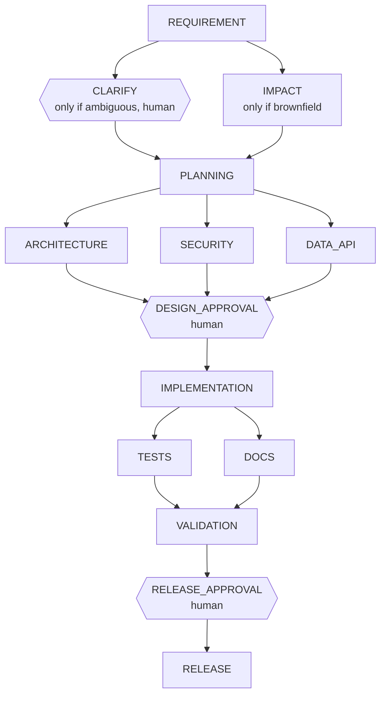

# Architecture

## 1. Principle

Agents execute under defined autonomy boundaries; humans own approvals and final quality.
The orchestrator is plain, deterministic code. It decides what runs, when, and under which rules.
Agents are replaceable workers behind a one-method interface (`Agent`), so control never depends
on a model.

## 2. Components

| Component | Responsibility |
|---|---|
| `StageGraph` | Declarative DAG of 14 stages. Validates on construction (duplicates, unknown dependencies, cycles). Answers "what is downstream of X". |
| `Orchestrator` | The engine loop: finds runnable stages, applies conditions, pauses at approval gates, runs batches in parallel, handles retry, fallback, rollback, stop and re-planning. |
| `PolicyGuard` | Security policy: no secrets in any agent output or human note. Never echoes the secret in its message. |
| `Agent` | `SimulatedAgent` (deterministic), `ClaudeAgent` (model-backed for 5 stages, delegates the rest). |
| `Run` and friends | State: stage executions, versioned artifacts with hashes, decisions, audit events. |
| `MetricsService` | Reliability metrics derived from the audit log. |
| REST API | Operate runs (start, approve, reject, stop, audit, metrics). |
| URL shortener | The use case, also a standalone service. |

## 3. Lifecycle graph

Non-linear behavior:

- **Fan-out and joins**: ARCHITECTURE, SECURITY and DATA_API run in parallel after PLANNING and join at DESIGN_APPROVAL; TESTS and DOCS run in parallel and join at VALIDATION.
- **Conditional stages**: CLARIFY runs only if the requirement is ambiguous; IMPACT only for brownfield runs. Otherwise they are `SKIPPED` and do not block dependents.
- **Backward edges**: a rejection or a changed upstream output invalidates downstream stages and re-runs them.

## 4. Control flow

The engine repeats this loop until nothing can progress:

1. If safe-stop was requested, stop (no new stage starts).
2. Collect stages that are `PENDING` or `INVALIDATED` and whose dependencies are all done.
3. Skip stages whose condition does not apply.
4. Pause stages that require approval (`WAITING_APPROVAL`) and record the request.
5. Run the remaining stages in parallel (virtual threads) and wait for all of them (synchronization point).
6. For each failed stage: rollback (after the whole batch has finished, to avoid races).

A run ends `DONE` (all stages done), `WAITING_APPROVAL` (paused for a human), `FAILED` or `STOPPED`.

**Gates.** Entry gate: all dependencies done and the stage condition holds. Exit gate: the agent
returned output and `PolicyGuard` accepted it. Human gates are stages with `requiresApproval`.

## 5. State and decision lineage

- `Artifact`: output of a stage, versioned, with a SHA-256 hash.
- `Decision`: who (agent or human) decided what, why, and which artifacts it was based on.
- `AuditEvent`: append-only log of every transition (start, retry, approval, rollback, policy violation...).
- `StageExecution` stores the hashes of its input artifacts and its attempt count.

## 6. Controls and where they are tested

| Control | Mechanism | Test |
|---|---|---|
| Human approval for high-impact actions | `requiresApproval` on DESIGN_APPROVAL and RELEASE_APPROVAL; approvals only accepted for stages waiting | `greenfieldNeedsTwoHumanApprovals`, `approvalOutOfOrderIsRejected` |
| Conditional path | Stage conditions | `brownfieldRunsImpactAnalysis` |
| Ambiguity handled without inventing | CLARIFY gate with human answer recorded as an artifact | `ambiguousRequirementStopsForHumanClarification` |
| Bounded retries | `maxRetries` per stage (up to 3 attempts) | `failingStageIsRetriedThenSucceeds` |
| Fallback | Simulated agent after retries are exhausted | `fallbackAgentTakesOverWhenPrimaryKeepsFailing` |
| Rollback | Back to the last approved checkpoint; the approved checkpoint stays valid | `rollsBackToLastApprovedCheckpointWhenEverythingFails` |
| Safe-stop | Flag checked between stages and between attempts | `safeStopPreventsNewStagesFromStarting` |
| Security policy | `PolicyGuard` on agent output and approval notes | `PolicyGuardTest`, `policyGuardBlocksSecretsAndFallbackProducesCleanOutput` |
| Re-planning | Output hash change invalidates downstream stages; rejection restarts from a defined stage | `rejectingTheDesignReplansAndReRunsDependentStages` |
| Bounded rejections | A gate rejected more than twice fails the run | `tooManyRejectionsFailTheRun` |

## 7. Metrics

Computed from the audit log (`GET /metrics`):

- **Success rate** = done / (done + failed + stopped). Runs still in progress are excluded.
- **Retries, rollbacks, policy violations, approvals, rejections**: event counts.
- **MTTR** = time from a stage's first failure to its next success. Failures that never recover are not counted.
- **End-to-end latency** = start to done, for completed runs. It includes time spent waiting for humans.

## 8. Key decisions

| Decision | Why | Trade-off |
|---|---|---|
| Declarative graph instead of if/else | Testable, inspectable, validated at startup | Extra indirection for a 14-stage graph |
| Deterministic engine, agents behind an interface | Control never depends on a model; agents are swappable | Engine cannot "reason" about unexpected situations |
| Approval only at design and release | Balances control and autonomy; both are costly to reverse | Implementation runs without a human in the loop |
| Hash-based re-planning | Simple, deterministic, no unnecessary rework | Detects change, not whether the change matters |
| Rollback after the parallel batch finishes | Avoids undoing work that is still running | A failure is acted on slightly later |
| Simulated agent as fallback and for tests | Deterministic tests; runs without an API key | Fallback output is a template, not real work |
| In-memory state | Fast and simple for a prototype | State is lost on restart |
| One lock per run (`synchronized`) | Simple and correct for a single node | Does not scale across nodes |
